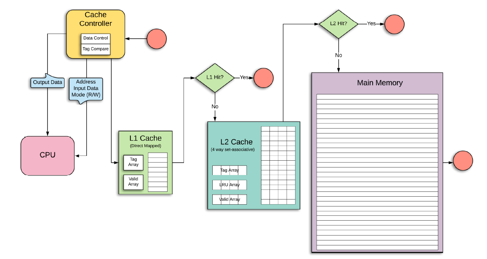
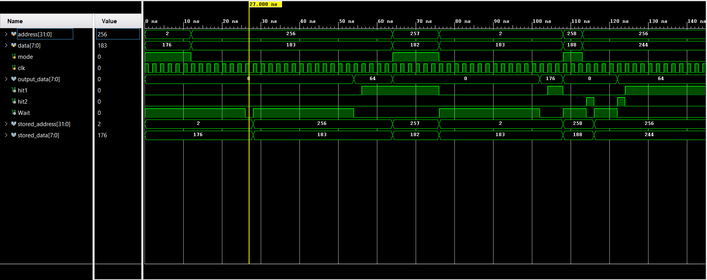
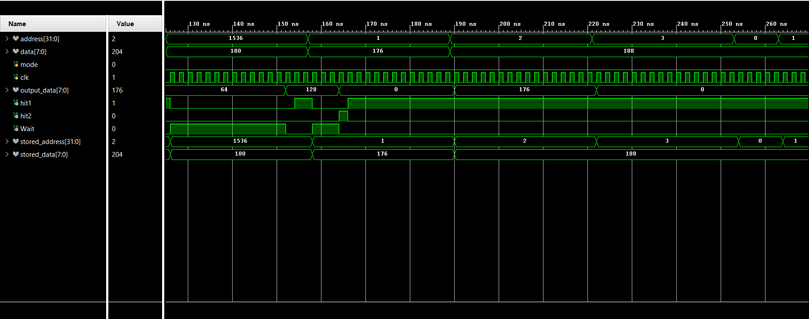
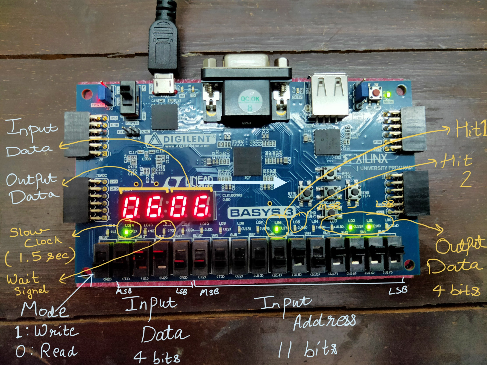

# Cache Controller
Cache Controller is a hardware which acts as an intermediate between the processor and the cache memory. It executes the read and write requests from the processor and copies or replaces data within
different levels of cache memory and main memory to reduce the average time taken by the processor
to retrieve data from an address.

# Our Work
Here in this project, we have implemented a Cache Controller for two layers of Cache Memory - L1 Cache and L2 Cache. The block diagram of the implemented Cache Controller is presented below.

  

## Project Video
Link to project video: [Cache Controller](https://drive.google.com/file/d/1rR0kxIyxufQ5pK3DtcUsePRGd8cnsd2F/view?usp=sharing)

This video contains brief theoretical explanations, explanation of simulation waveforms and shows the cache controller running on the FPGA.

# Theoretical Details about the Cache controller

### Memory units implemented
* L1 Cache
* L2 Cache
* Main Memory

### Mapping Details
* The **L1 Cache** uses **direct mapping**. In direct mapping, a particular block of main memory can map to only one   particular line of the cache.

* The **L2 Cache** uses **4-way set-associative mapping**. In this mapping, a block in main memory is not mapped to one particular cache line but is instead mapped to a set containing memory locations (in our case 4), where the block can be stored.

### Replacement policies
* The **Least Recently Used (LRU)** replacement Policy is used for replacing memory blocks in the cache memory whenever a memory block needs to be placed in a location which has already been occupied.

### Write policies used
*  **No Write Allocate Policy** - In no write allocate policy, when a write miss occurs in a lower level of cache memory, the data is updated in the higher level of cache memory or in main memory (wherever
found), but is not loaded into the lower level cache memory.

*  **Write Back Policy** - In write-back policy, the data is updated in a cache level every time a write instruction is issued by the processor, but it is written into higher levels of cache or main memory only when the memory block evicts from the lower cache level.

# Implementation Details

## Project Folders
Two project folders are present in the repository.
1. `Cache_Controller_Simulation_Project`
2. `Cache_Controller_FPGA_Implementation_Project`

The essential code present in both the projects is the same except the parameter values, clock speeds amd few other considerations. 

Therefore **Project 1** `Cache_Controller_Simulation_Project` has been commented comprehensively and **Project 2** `Cache_Controller_FPGA_Implementation_Project` has been commented only on 
the places where the parameters differ from Project 1. 

## Usage Details
The 2 projects have been customized separately for a better experience. Please use them as follows:
* Use `Cache_Controller_Simulation_Project` for viewing simulations and implementations details. This folder contains comprehensively commented code, memory and cache sizes used correlate to real-world sizes.

* Use `Cache_Controller_FPGA_Implementation_Project` if you are synthesizing the Verilog code on a Field Programmable Gate Arrays (FPGA). This folder contains reduced memory block sizes and some implementation related code.

### Major changes in Cache_Controller_FPGA_Implementation_Project
* The sizes of memory taken in this project are small so that the code can be synthesizable on the FPGA
* The processor clock speed has been slowed so that the simulations can be viewd on the FPGA board.

## Running the project
To run a project follow these steps:

1. Open the project folder in [Xilinx Vivado](https://www.xilinx.com/products/design-tools/vivado.html) software
2. Open the `.xpr` file in the project folder
3. Run the project

# Example Results

## Simulation
Some of the simulation images are presented below.

  

  

## FPGA Implementation
The FPGA ports used for different purposes are labelled in the image.

  

  

You can see the FPGA in action in this video: [Cache Controller](https://drive.google.com/file/d/1rR0kxIyxufQ5pK3DtcUsePRGd8cnsd2F/view?usp=sharing)

# Brief Explanation of the implemented modules

## **CACHE_CONTROLLER**

### About the module
This is the main module in the project which contains all the  code regarding the operations performed by the Cache Controller. The size of L1 Cache here is 64 lines, 128 lines for L2 and 16384 lines for Main Memory. Each line in the Cache or main memory contains one or more blocks ,where each block is made up of many bytes.

### Working Details
The byte size is taken to be 8 bits. Each block consists of 4 bytes here, which are indexed using block-offset bits.
Given below is the workflow of the Code in brief:

1. Checking the mode if read or write. Before taking the input the wait signal is checked to know whether the controller is busy executing the previous instruction.
2. In READ operation, first the controller searches in the L1 Cache.
3. If found in L1 Cache, give L1 hit signal as 1 and returns the read data to processor.
4. If not found in L1 Cache, the address is searched in L2 Cache.
5. While searching in L2 Cache, a delay of 2 cycles is implemented for the controller. If found in L2 Cache, the address is then promoted in L1 Cache.
6. While promoting in L1 Cache, if there was some block stored in that location in L1, it needs to evicted to make space for the new block. Also the data of the evicted block needs to updated in L2 (if present in L2) or in Main memory (if not found in L2).
7. In case the address to be read was not even present in L2 Cache, then the search in main memory begins, there has been a delay of 10 cycles implemented for searching in main memory.
8. After getting the data from main memory, it needs to promoted in L2 and then to L1 Cache. Now there may be case that its position in L2 is occupied already. Then a block in L2 needs to evicted, whose value needs to be updated in main memory before.
9. Now the block needs to be promoted to L1 Cache as well which may also be occupied by some block already. This process has been discussed before as well of evicting a block from L1 in point 6.
10. Finally the data from the address is given to the processor.
11. In WRITE operation, the address is first searched in L1 Cache.
12. If found in L1 Cache, the data at address is modified and controller is ready for next instructions by processor.
13. If not found in L1 Cache, the Cache controller searched in L2 Cache and modifies data there if the address was found.
14. If not found in L2 Cache, the Cache controller searched in main memory and modifies data there.
15. Note here in write operation, no promotion to L1 or L2 Cache are made as per the Write No-Allocate policy and hence no evictions in L1 and L2 Cache as well.

## **L1_CACHE_MEMORY**
This module contains the implementation of the memory for L1 Cache, which briefly contains the memory array, tag array and the valid array. It has been initialized in the module as well.

## **L2_CACHE_MEMORY**
This module contains the implementation of the memory for L2 Cache, which briefly contains memory array, tag array, LRU array and the valid array. It has been initialized in the module as well.

## **MAIN_MEMORY**
This module contains the implementaton of the memory for main memory, which briefly contains a memory array.
It has been initialized in the module as well.

## **Testbench Details**
Please refer to the testbench file "TB_READ" present in "Cache_Controller_Simulation_Project". The test-cases and expected outcomes have been well explained in this file.  
